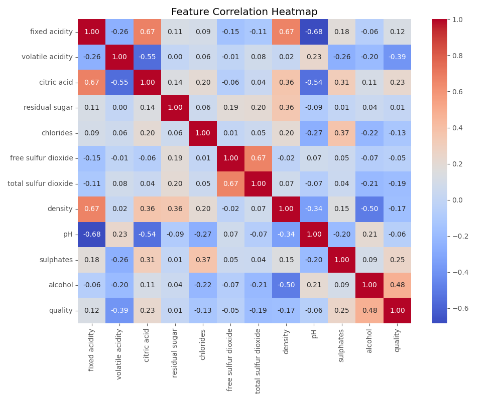
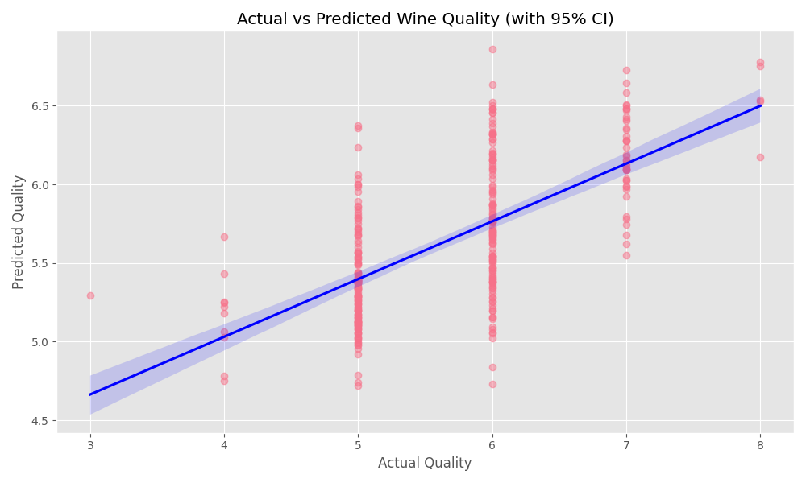
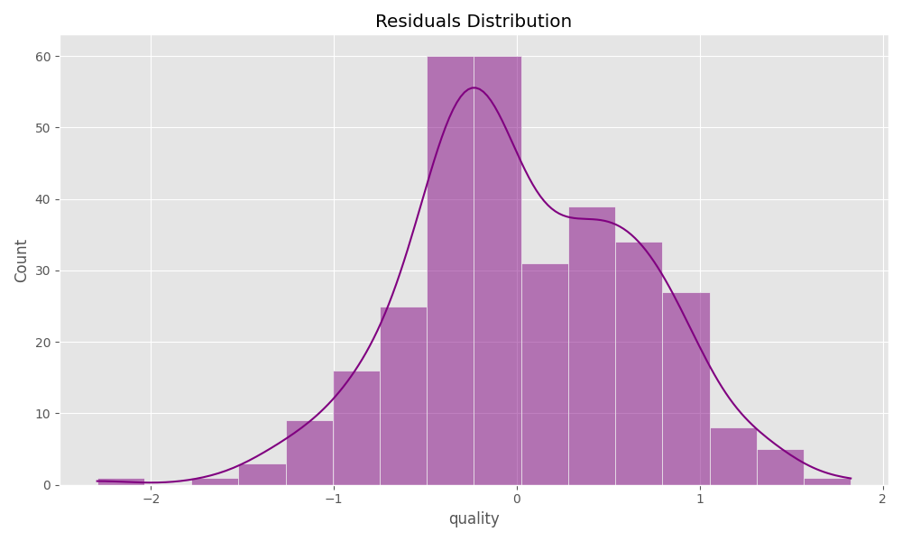

# 紅酒品質預測分析報告 (多元線性回歸)

**學生姓名：** 劉禹彤  
**學生學號：** 4112056006  
**分析主題：** 基於化學特徵之紅酒品質多元線性回歸分析  

---

## 一、 資料來源與連結
本次分析採用 Kaggle 公開資料集：**Red Wine Quality**。
*   **資料來源：** UCI Machine Learning Repository
*   **Kaggle 連結：** [https://www.kaggle.com/datasets/uciml/red-wine-quality-cortez-et-al-2009](https://www.kaggle.com/datasets/uciml/red-wine-quality-cortez-et-al-2009)
*   **特徵數量：** 11 個理化特徵（如酒精濃度、酸度、pH值等）。

---

## 二、 CRISP-DM 分析流程說明

### 1. Business Understanding (業務理解)
紅酒的品質評估傳統上依賴於品酒師的感官測試，這存在主觀性且成本高昂。本研究的目標是透過理化檢測數據，建立一個客觀的「多元線性回歸模型」，以預測紅酒的品質評分（0-10分），幫助釀酒商在生產過程中即時監控品質並優化製程。

### 2. Data Understanding (資料理解)
本資料集包含 1,599 個紅酒樣本。透過相關性分析，我們發現特徵間的關聯性：
*   **酒精 (Alcohol)** 與品質呈顯著正相關。
*   **揮發性酸度 (Volatile Acidity)** 與品質呈負相關，過高會導致異味。

### 3. Data Preparation (資料準備)
*   **缺失值處理：** 經檢查，本資料集無缺失值。
*   **資料標準化：** 使用 `StandardScaler` 將所有特徵縮放至平均值為 0、標準差為 1，以確保模型不受單位差異影響。
*   **特徵選擇 (Feature Selection)：** 透過 `SelectKBest` 演算法，從 11 個特徵中篩選出對目標變數影響力最強的 8 個特徵，以降低模型複雜度並避免過擬合。

### 4. Modeling (建模)
本研究採用 **多元線性回歸 (Multiple Linear Regression)** 模型。此模型能清楚揭示各項理化特徵對品質分數的線性貢獻度。

### 5. Evaluation (評估)
模型在測試集上的表現如下：
*   **Mean Squared Error (MSE):** 0.3892
*   **Mean Absolute Error (MAE):** 0.5034
*   **R-squared (R²):** 0.4032
*   **結果分析：** R² 值約 0.4，顯示模型能解釋約 40% 的品質變動。從預測圖中可見，模型對於中間品質（5-6分）的預測較為準確，對於極端值的捕捉仍有提升空間。

### 6. Deployment (部署)
此模型可部署於酒廠的數位監控系統，作為自動化檢測的第一道關卡，當預測評分低於門檻時，可即時警示並進行人工複檢。

---

## 三、 NotebookLM 研究摘要
以下為透過 NotebookLM 針對 IEEE 及 ScienceDirect 相關論文研究後之總結摘要：

> 這三篇研究論文共同探討了利用機器學習（ML）技術取代傳統主觀感官評估，實現客觀且高效的紅酒品質預測。
> 1. 研究方法與數據預處理: 研究主要採用來自 UCI 機器學習庫或 Kaggle 的數據集（如葡萄牙的 "Vinho Verde" 紅白酒），關注酒精濃度、酸度與 pH 值等理化特徵。為了克服數據不平衡問題，研究者使用了 SMOTE 方法生成合成數據，並透過多種特徵選擇技術篩選出對品質影響最大的「關鍵變數」。
> 2. 模型表現分析: 在眾多算法中，**集成學習（Ensemble Learning）**模型表現最為卓越：XGBoost 與 Random Forest 準確率可達 93% 以上。線性模型雖然具有可解釋性，但在處理複雜的非線性關係時表現遜於上述模型。
> 3. 關鍵影響因素: 研究一致指出，**酒精濃度（Alcohol）是與高品質呈最強正相關的特徵，而揮發性酸度（Volatile Acidity）**則是負面影響品質的最關鍵因素。
> 4. 實踐價值與結論: 透過機器學習驅動的預測，釀酒商能夠從被動的品質檢查轉向主動的品質保證，優化生產流程。

---

## 四、 網路上主流或更優解法之比較與說明
在本專案中，我們使用的是多元線性回歸模型，其優點在於**運算快速且具備極佳的可解釋性**，能直觀地看出各化學特徵對品質的線性影響。然而，根據 NotebookLM 所整理的學術論文與 Kaggle 競賽解法，更優的解法通常具備以下特點：

1.  **模型準確度差異：** 
    *   **本模型：** 使用線性回歸，R-squared 約為 0.40。
    *   **主流模型：** 網路上主流採用 **XGBoost** 與 **Random Forest (隨機森林)**。根據文獻顯示，XGBoost 的準確率可達 **93.10%**，而隨機森林在特定條件下甚至能達到 **94.51% 至 97.79%** 的高精確度。
2.  **數據不平衡處理：** 
    *   主流優解法通常會使用 **SMOTE (Synthetic Minority Over-sampling Technique)** 技術來生成合成數據，解決紅酒品質分布不均（如高品質 8 分與低品質 3 分樣本極少）的問題。
3.  **處理非線性關係：** 
    *   紅酒品質評分並非單純的線性加總，而是多種理化因子間複雜的化學交互作用。線性回歸難以捕捉這些非線性特徵，而集成學習模型 (Ensemble Learning) 能有效處理高維數據並防止過擬合，因此表現更佳。
4.  **結論：** 
    *   雖然線性回歸在學術研究中是理解變數影響力的重要基準，但在追求實際預測精準度時，網路上普遍認為集成學習模型結合 SMOTE 預處理是目前的「最佳實踐」。

---

## 五、 GPT 輔助內容標示
本報告與專案程式碼之以下部分係在 GPT 輔助下完成：
*   Python 資料視覺化繪圖邏輯（Matplotlib/Seaborn 參數設定）。
*   特徵選擇演算法（SelectKBest）之選取建議。
*   報告架構與 CRISP-DM 流程文案之優化。

---
